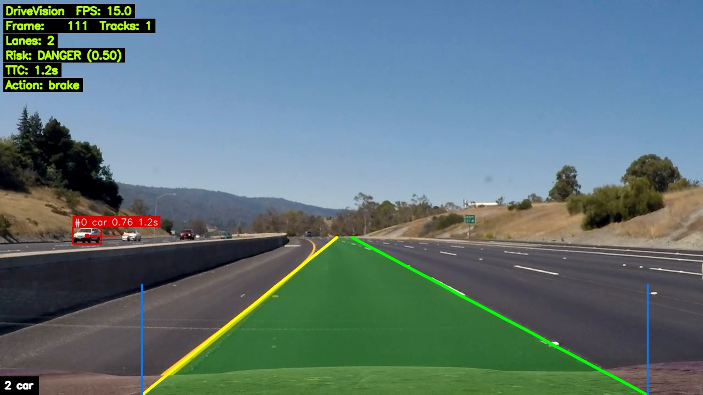
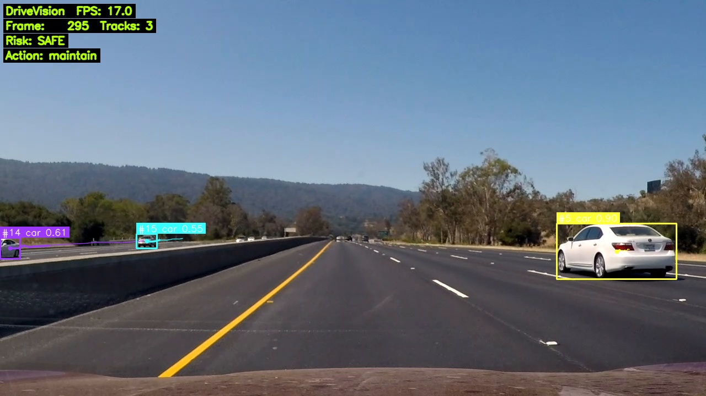
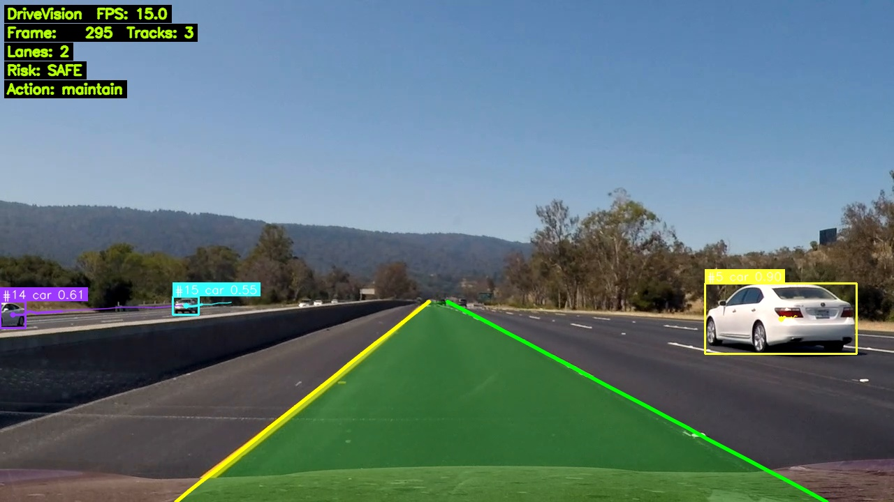
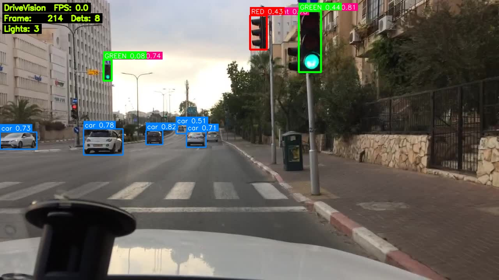

<div align="center">

# 🚗 DriveVision

**A modular, real-world autonomous-driving _perception_ platform — from camera frames to an explainable driving advisory.**

Object detection · multi-object tracking · lane detection · traffic-light state · scene understanding · risk assessment · decision support — wired into one clean, config-driven pipeline.

[](https://www.python.org/)
[](#-testing)
[](https://github.com/ultralytics/ultralytics)
[](#-license)



<sub>One frame, fully understood: detected & tracked vehicles (IDs + trajectories), drivable ego-lane, lane boundaries, a per-object **time-to-collision**, an aggregate **risk level**, and an **advisory action** — all on the HUD.</sub>

</div>

---

## ✨ What it does

DriveVision takes a driving video (dashcam, BDD100K, KITTI, later CARLA) and turns each frame into a structured understanding of the scene and a clear, **explainable** driving recommendation:

| Capability | How |
|---|---|
| 🟦 **Object detection** | YOLOv8 (COCO) — cars, people, buses, trucks, bikes, traffic lights |
| 🟨 **Multi-object tracking** | IoU + **Hungarian** `SimpleTracker` *or* **ByteTrack** — stable IDs + trajectories + pixel velocity |
| 🛣️ **Lane detection** | Classical CV (HLS colour + Canny + Hough + polynomial fit + temporal smoothing), optional bird's-eye sliding-window |
| 🚦 **Traffic-light state** | Reuses YOLO boxes, classifies **red / yellow / green** via HSV |
| 🧠 **Scene understanding** | Ego-lane, per-object lane assignment, **lead vehicle**, applicable traffic light, scene summary |
| ⚠️ **Risk + decision** | **Looming-based TTC**, rule-based risk levels, advisory action (`MAINTAIN → SLOW_DOWN → BRAKE → STOP`) with a human-readable reason |
| 🎥 **Visualization** | A single `Annotator` renders boxes, IDs, trajectories, lanes, ego corridor, lights, and a live HUD |

> **Scope note.** DriveVision is a **perception + advisory** system (the "see & understand" half of autonomy). It is *not* a control stack — it never actuates throttle/brake/steering. Decisions are ADAS-style suggestions, by design.

---

## 🏗️ Architecture

DriveVision separates **where models are trained** from **where they run** — they only ever exchange a weights file.

```
┌─ RESEARCH PLANE (Kaggle GPU) ───────────────────────────────────────┐
│   prepare data → fine-tune → export weights (.pt)                    │
│                          │  (the ONLY interface: a weights file)     │
├─ RUNTIME PLANE (local CPU) ─────────────────────────────────────────┤
│                                                                     │
│  VideoSource ─▶ Pipeline ─▶ Annotator ─▶ CLI / API / Dashboard      │
│                   │                                                   │
│   Detection ▶ Tracking ▶ Lane ▶ TrafficLight ▶ Scene ▶ Risk ▶ Decision
└─────────────────────────────────────────────────────────────────────┘
```

Every stage implements a small ABC and is **optional** (`None` = skip), so the pipeline runs end-to-end at any level of completeness. Everything is selected and tuned from a single YAML config — no code changes to toggle a stage.

The entire runtime runs comfortably on **CPU**; only model fine-tuning needs a GPU (hence the Kaggle plane).

---

## 🖼️ More demos

| Tracking (IDs + trajectories) | Lane + ego corridor | Traffic-light state |
|:---:|:---:|:---:|
|  |  |  |

---

## 🚀 Quick start

```bash
# 1. Environment (Python 3.12)
python -m venv .venv && source .venv/bin/activate
pip install -e ".[perception,dev]"        # opencv, numpy, scipy, ultralytics, torch, pytest

# 2. Put a driving clip at data/samples/sample.mp4 (any dashcam mp4 works)

# 3. Run the full pipeline and save an annotated video
python scripts/run_pipeline.py --source data/samples/sample.mp4 --save output/demo.mp4

# Options: --display (window) · --max-frames N · --conf 0.5 · --config configs/default.yaml
```

The first run auto-downloads the YOLOv8n weights (~6 MB). The output is an MP4 with the full HUD.

---

## ⚙️ Configuration

Everything lives in [`configs/default.yaml`](configs/default.yaml) and is deep-merged over built-in defaults. Highlights:

```yaml
perception:
  detection:     { enabled: true, weights: models/weights/yolo.pt, conf: 0.35, imgsz: 640 }
  tracking:      { enabled: true, backend: simple, min_hits: 3 }   # simple | bytetrack
  lane:          { enabled: true, method: classical, use_perspective: false }
  traffic_light: { enabled: true, classifier: hsv }
risk:
  enabled: true
  ttc_warn: 3.0
  ttc_danger: 1.5            # TTC ≤ this → DANGER → BRAKE
output:
  save_path: output/demo.mp4
  display: false
```

Override per-run on the CLI (`--conf`, `--max-frames`, …) or with a small YAML passed via `--config`.

---

## 📊 Evaluation

DriveVision measures the **right metric for each component** — speed needs no labels, accuracy does. Full methodology in [`EVALUATION.md`](EVALUATION.md).

### Speed (CPU, Intel i7-1355U, YOLOv8n)

| Stage | Cost / frame | Notes |
|---|---|---|
| Detection (imgsz 640 / 320) | 50 ms / 21 ms → **19 / 45 FPS** | dominates the pipeline (~98%) |
| Tracking (SimpleTracker) | < 0.5 ms (4.8 ms @ 50 tracks) | Hungarian matching |
| Lane (classical) | 8 ms | 0 crashes over 100 real frames |
| Traffic-light (HSV) | 0.1 ms / light | — |
| Scene understanding | 0.02 ms | pure geometry |
| Risk + decision | 0.09 ms | rule-based |

### Accuracy — detection baseline (zero-shot COCO → BDD100K val, 10k images)

| Model | mAP@50 | mAP@50-95 | Precision | Recall |
|---|---|---|---|---|
| YOLOv8n pretrained | **0.225** | 0.128 | 0.371 | 0.248 |

This deliberately-modest zero-shot number is the **baseline that motivates fine-tuning** (the Kaggle research plane): COCO knows *what a car looks like*, but not the driving domain (small/distant objects, night, rain). Re-run any time:

```bash
python scripts/eval_accuracy.py --weights models/weights/yolo.pt --data configs/bdd_val_coco.yaml --device cpu
```

---

## 🧪 Testing

```bash
PYTHONPATH=src pytest -q          # 103 tests, all green
```

Unit + integration tests cover every stage with synthetic frames (no GPU, no video needed): bbox geometry, annotator, tracker ID consistency / Hungarian matching, lane edge-cases, traffic-light HSV, scene reasoning, TTC physics, and the decision state machine.

---

## 📁 Project layout

```
src/drivevision/
  types.py            # shared dataclasses (the project's contract)
  config.py           # YAML config + defaults
  io/                 # DataSource: video / webcam / CARLA (stub)
  perception/         # detection · tracking · lane · traffic_light
  scene/              # SceneBuilder (ego-lane, lead vehicle, summary)
  risk/               # TtcEstimator · RiskAssessor · ego-lane membership
  decision/           # DecisionSupport (advisory actions)
  viz/                # Annotator (boxes, trajectories, lanes, HUD)
  pipeline/           # Pipeline orchestrator + config-driven builder
  api/                # FastAPI server + MJPEG stream (next milestone)
  cli.py              # entry point
scripts/              # run_pipeline · benchmark · eval_accuracy · convert_bdd_to_yolo
configs/              # default.yaml + dataset/eval configs
tests/                # pytest suite
```

---

## 🗺️ Roadmap

| | Stage | Status |
|---|---|:---:|
| ✅ | Object detection + visualization + output | done |
| ✅ | Multi-object tracking (Hungarian + ByteTrack) | done |
| ✅ | Lane detection (classical CV) | done |
| ✅ | Traffic-light detection + state | done |
| ✅ | Scene understanding (ego-lane, lead vehicle) | done |
| ✅ | Risk assessment + decision support | done |
| 🔜 | FastAPI + MJPEG dashboard | next |
| 🔜 | Fine-tuning on BDD100K (Kaggle) | planned |
| 🔜 | CARLA integration (real depth → metric TTC) | planned |
| 🔜 | Portfolio polish (CI, Docker, demo GIFs) | planned |

---

## 🛠️ Tech stack

`Python 3.12` · `Ultralytics YOLOv8` · `PyTorch (CPU)` · `OpenCV` · `NumPy` · `SciPy` · `PyYAML` · `pytest` · `FastAPI` (dashboard)

---

## ⚠️ Limitations (honest notes)

- **Looming TTC** assumes a head-on approach; crossing / oncoming objects can read as risky. Real metric TTC arrives with CARLA depth.
- **Traffic-light HSV** classifies whatever YOLO labels `traffic light`; small/distant lights and COCO false positives reduce accuracy. Fine-tuning on BDD100K (which has a dedicated `traffic sign` class) is the fix.
- **Lane detection** is classical and tuned for clear markings; a learned model (YOLOP / UFLD) is the upgrade path behind the same interface.

---

## 📜 License

MIT — built as a portfolio project to demonstrate clean perception-system architecture, classical + learned CV, and explainable decision logic.

🤖 Detection powered by [Ultralytics YOLOv8](https://github.com/ultralytics/ultralytics).
